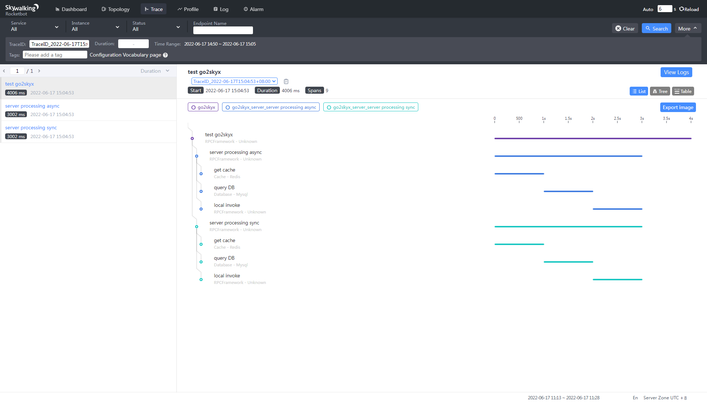

# go2skyx

`go2skyx` is a tool library, based on [GO2Sky](https://github.com/SkyAPM/go2sky), to report tracing infos
to [SkyWalking](https://github.com/apache/skywalking) by gRPC.

## Motivation

`GO2Sky` is excellent to use `SkyWalking` with `Go`. But it is not easy enough for developers who do not know a lot concept
of `SkyWalking` to use. And because of high encapsulation, `GO2Sky` is very hard to extend with business. 
So `go2skyx` makes some api for easily using and also provides some new feature (e.g. custom TraceID).

## Feature

- report tracing infos to `SkyWalking` by `gRPC`
- create and setup `tracer` and `span` with function options
- customize **`traceID`**, `spanLayer`, `component`, `endpoint`, `peer`, `tags` and anything

## Usage

You can create a `tracer` by default:

```go
tracer, cleanup, err := NewTracer()
```

Then use `tracer` to report a `span`:

```go
xCtx, span, errCreateSpan := tracer.CreateSpan(context.Background())
span.Log("key", "value")
span.End()
```

By two functions, everything is done. But unfortunately, using default options is not enough for your business most time. So you should pass some optional parameters to customize your tracing infos.

For `tracer`:

```go
tracer, cleanup, err := NewTracer(
    // SkyWalking gRPC addr, default 127.0.0.1:11800
    WithAddr(addr),
    // service, default go2skyx
    WithService("go2skyx"),
    // samplingRate, default 1.0
    WithSamplingRate(samplingRate),
)
```

For `local span`:

```go
xCtx, spanLocal, errLocal := tracer.CreateSpan(context.Background(),
    WithSpanLayer(SpanLayerRPCFramework),
    WithEndpoint("local invoke"),
)
```

For `client span`:

```go
xCtx, span, errCreateSpan := tracer.CreateSpan(context.Background(),
    WithInjector(func(headerKey, headerValue string) error {
        // inject function for propagation with cross_processing
        return nil
    }),
    WithSpanLayer(SpanLayerRPCFramework),
    WithEndpoint("test go2skyx"),
    WithTraceID("TraceID_"+time.Now().Format(time.RFC3339)),
    // you can add any tag
    WithTag(TagURL, "..."),
}
```

For `server span`:
```go
xCtx, spanServer, errServer := tracer.CreateSpan(context.Background(),
    WithExtractor(func(headerKey string) (string, error) {
        // extract function for propagation with cross_processing
        return propagationMap[headerKey], nil
    }),
    WithSpanLayer(SpanLayerRPCFramework),
    WithEndpoint(endpoint),
)
```

We provide a full trace usage by mocking invocation with [go2skyx_test.go](#). Run it and you can see tracing info by `SkyWalking Web UI` like:


## TODO

- fix documents
- add `golangci`

## Reference

- [Apache SkyWalking](https://github.com/apache/skywalking)
- [GO2Sky](https://github.com/SkyAPM/go2sky)
- [go2sky-plugins](https://github.com/SkyAPM/go2sky-plugins)
